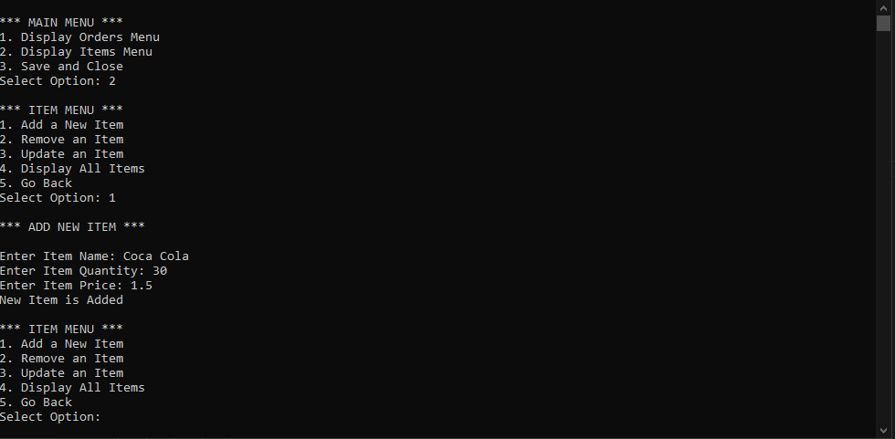

# POS-Business-Console-Based-
Welcome to our Java-based Point of Sale (POS) application, designed for efficient and intuitive management of sales transactions. With robust features and a user-friendly interface, streamline your business operations seamlessly.

Here are main features of our application:
1. Products Management
2. Transactions Management
3. Sales Tracking
4. Inventory Handling and Counting

### Screenshots

